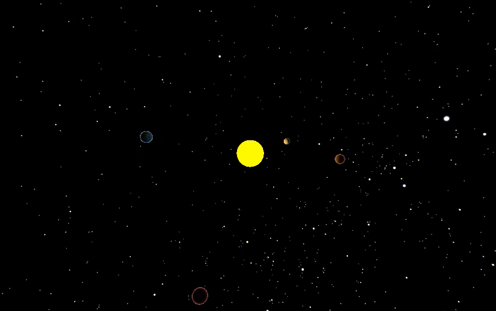
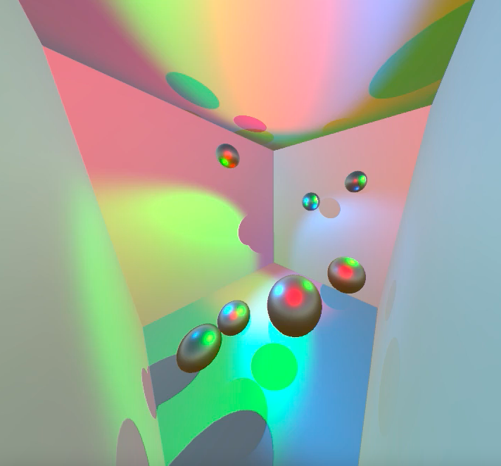
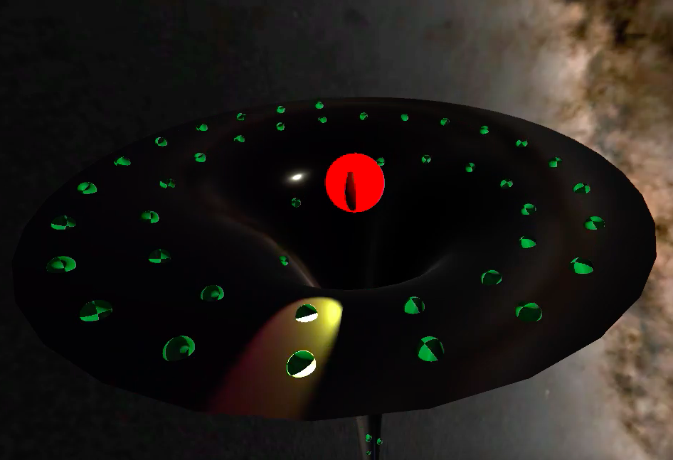

# UnityCourse
Homework assignments for the APL strategic education course _Real-Time Simulation in Unity for Physicists and Engineers_.

## All The Planets
Scripting in Unity to render a solar system.

## Bouncy Attractors
Experimenting with spotlights and collisions.

## Gravity Well
Instantiating prefabs, and destroying. And a surface generated in [Blender](https://www.blender.org).

